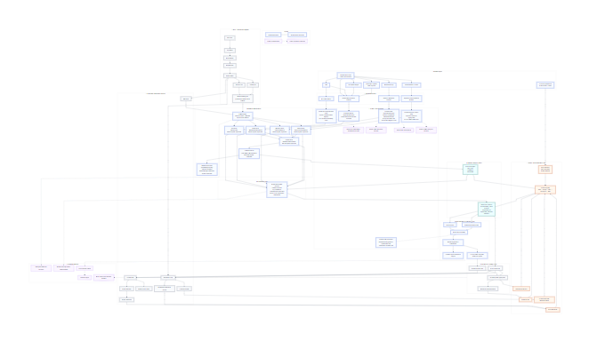
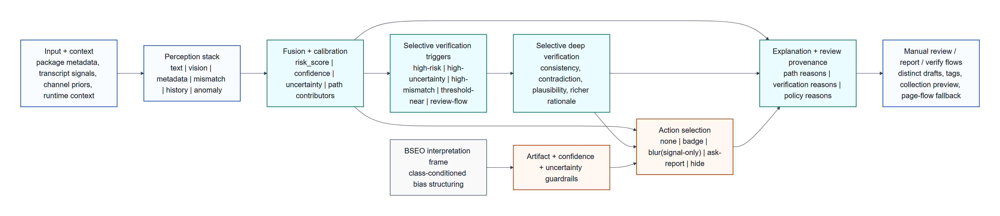
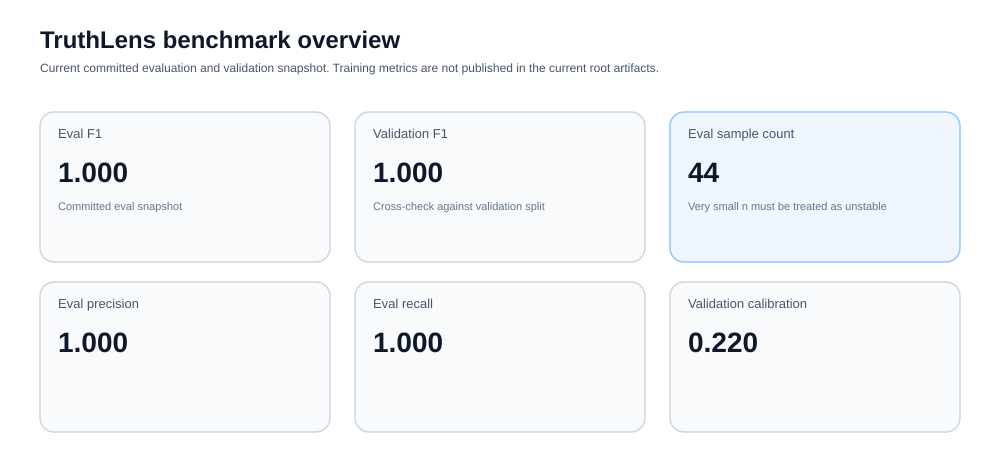
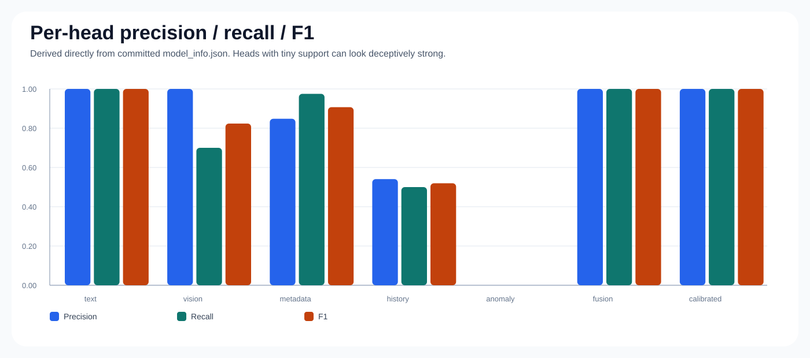
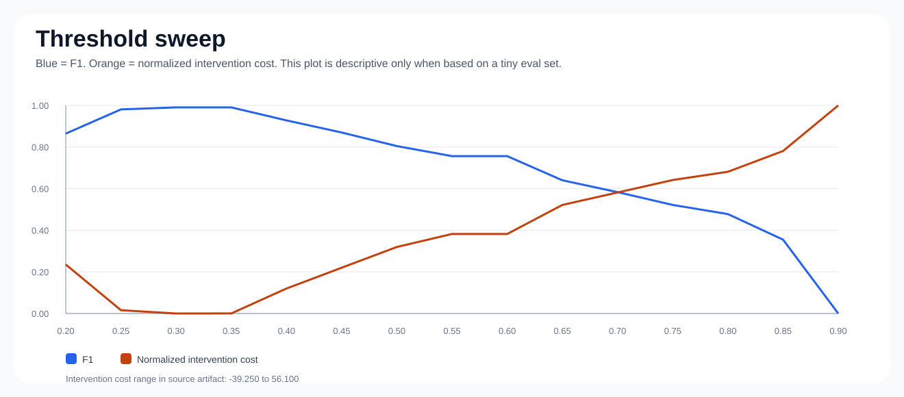
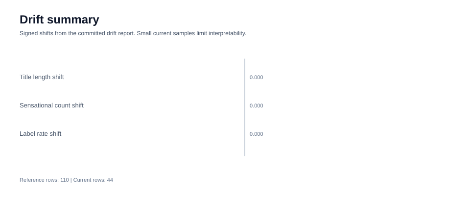
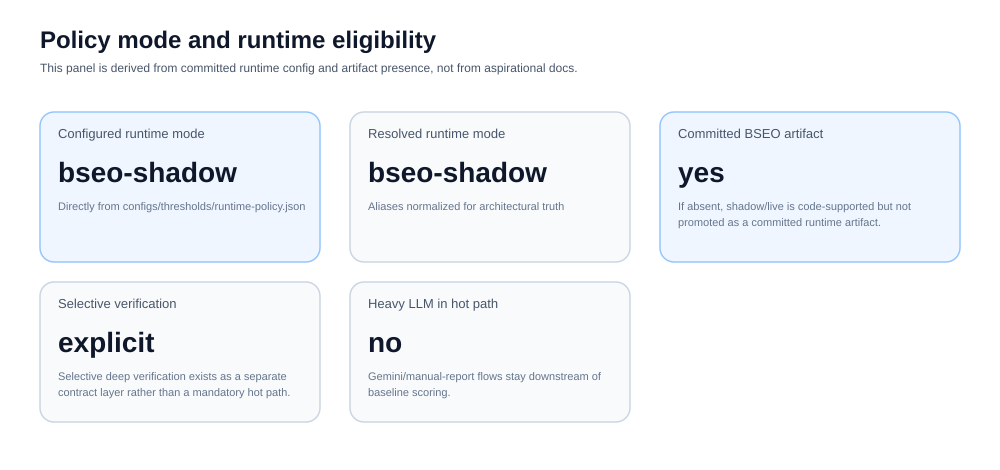
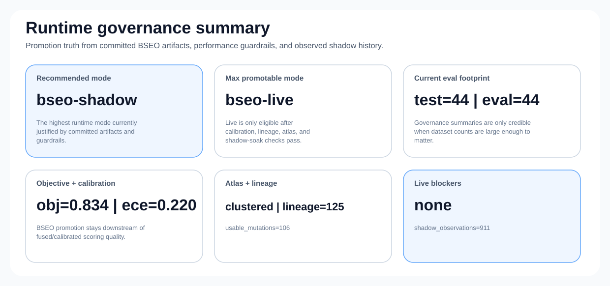
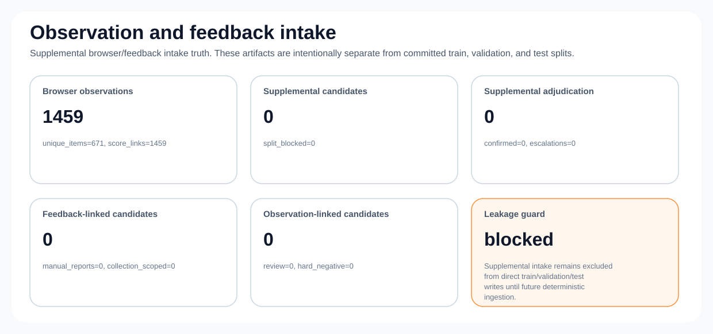

<p align="center">
  
</p>

# TruthLens

TruthLens is a multimodal browser-extension, API, trainer, and Android-share system for detecting, explaining, filtering, and supporting human review of misleading video packaging.

The repository already contains a hybrid scoring stack, optional learned paths, anomaly and history sidecars, BSEO policy/search code, trainer and simulation artifacts, explanation contracts, extension/mobile surfaces, and architecture tooling. This README is the GitHub-facing truth surface for what is actually committed now.

## First 60 Seconds

- TruthLens is currently a controlled extension-first beta project, not a broad public launch.
- The public repo is curated for repo truth: docs, policies, manifests, benchmark surfaces, and governance stay committed; raw payloads and heavy private artifacts do not.
- The first supported external path is an unpacked Chromium extension pointed at a real hosted API origin.
- Hosted beta now supports direct YouTube OAuth/report-submit when the deployment is configured for it and the connected account exposes a usable misleading-report category; otherwise single-item reports fall back to YouTube's in-page report flow and linked local TruthLens feedback.
- Current closure status and proof notes:
  - [Public hardening audit](docs/decision-records/wave1-public-hardening-audit.md)
  - [Hosted beta verification status](docs/deployment/hosted-beta-verification.md)

## Public Beta Positioning

TruthLens is not being positioned as a broad public launch yet. The current target is a controlled, extension-first hosted beta with GitHub as the primary truth surface.

What works now:

- Chromium extension flows for scoring, explanations, visible warning-state actions, manual review, transparency verification, and report drafting
- FastAPI endpoints for scoring, feedback, browser observation intake, manual report drafting, metrics, and runtime policy/model inspection
- hosted Gemini-assisted draft optimization when `TRUTHLENS_GEMINI_API_KEY` is set on the deployment
- hosted YouTube OAuth status, account-connect, and direct report-submit capability probing
- trainer, simulation, BSEO policy artifacts, benchmark renders, and governance surfaces
- Android share-client code for config-parity and internal validation

What is deliberately not part of the first external beta:

- browser-store distribution
- Android as a public beta surface
- any always-on heavy LLM classifier in the baseline runtime

Support matrix for the first hosted beta:

| Surface | Status |
| --- | --- |
| Chromium desktop extension on YouTube | first supported external beta surface |
| Hosted API | required for beta |
| Android share client | internal / experimental |
| Firefox | not committed as supported |
| iOS | not committed as supported |

Benchmark caveat up front:

- the metrics and visuals in this repo are committed internal artifact evidence
- they are useful for repo truth, regression tracking, and governance
- they are not broad real-world product claims

## Extension Beta Quick Start

For the first external beta path, use the hosted API plus an unpacked Chromium extension.

1. Read the hosted deployment contract: [Render hosted beta guide](docs/deployment/render-beta.md)
2. Use the starter managed deployment blueprint if you want Render to provision the beta baseline: [`render.yaml`](render.yaml)
3. Read the tester install path: [Extension beta install](docs/beta-install.md)
4. Use the current architecture and benchmark surfaces as the technical truth:
   - [Architecture docs](docs/architecture/README.md)
   - [Benchmark docs](docs/benchmarks/README.md)
5. Check the current live-hosted proof status before treating a hostname as real beta truth: [Hosted beta verification status](docs/deployment/hosted-beta-verification.md)
6. Keep in mind that direct YouTube API reporting is still deployment- and account-dependent; TruthLens supports hosted OAuth/report-submit when configured and falls back to page-level report flow plus local transparency verification when direct reporting is unavailable.

## Hosted Beta Live Snapshot

The first supported external beta surface is now live and manually proven.

| Field | Value |
| --- | --- |
| live origin | `https://truthlens-beta-api.onrender.com` |
| hosted runtime date | `2026-04-18` |
| `/ready` status | `200` |
| `/ready` artifact status | `compatible` |
| live model mode | `trained` |
| live model version | `baseline-v1-build-20260412135829` |
| live policy mode | `bseo-live` |
| live event store | `postgres` |
| latest proved counters after restart | `score_events_total=439`, `feedback_events_total=10`, `browser_observations_total=179` |

Live-hosted truth for this table comes from [Hosted beta verification status](docs/deployment/hosted-beta-verification.md), not from the benchmark summary JSON.

The live hosted runtime currently serves a newer promoted model bundle than the latest committed public benchmark artifact.
That is expected in the current beta: the live table above describes the mounted hosted runtime, while the benchmark tables below describe the latest benchmark artifact that is actually committed in this repository.

## Extension User Walkthrough

### What the score chip and review badge mean

- The floating chip on each card is the user-facing TruthLens truth score on a `0-10` scale where `10.0` is best and `0.0` is worst.
- Truth score is a user-facing inversion of internal badness: higher means more likely honest and transparent, while lower means more likely clickbait, misleading, or AI-generated noise.
- Feed scoring still merges channel history into the request path through `prior_flags`, `channel_risk_mean`, and `repeat_template_rate`, so repeat-negative channel context lowers the visible truth score.
- Badge colors follow the product contract exactly: `0.0-3.3` red, `3.4-4.9` orange, `5.0-6.6` yellow, `6.7-10.0` green.
- Local personalization and reranking still exist, but they are secondary layers: the hover text separates user-facing truth score, internal feed risk, raw runtime risk, channel-history adjustment, and local rerank priority.
- TruthLens can now locally rerank the feed in the browser extension. This is a user-side ordering layer on top of whatever YouTube already showed the current user; it does not change YouTube's backend recommendation system.
- `Verify transparent` is a separate review prompt. It appears only when the class-conditioned review contract thinks the item likely belongs to an honest-content lane such as `music`, `art`, or `gaming`, or when the fallback music-likelihood path is strong enough.
- A high chip can therefore appear with `Verify transparent`, and another high chip can appear without it. The badge is not driven by the chip alone.
- Hovering the badge shows the current TruthLens explanation, for example: `TruthLens thinks this likely looks like transparent music content.`

### Manual report flow

1. On a YouTube feed card, right-click the thumbnail.
2. Open the `TruthLens` submenu.
3. Choose `Report video with TruthLens`.
4. TruthLens opens the manual report sheet with:
   - a `TruthLens Context` block summarizing class, confidence, current action, and guardrail
   - a `Live status` rail that shows whether the draft came from Gemini or from the local heuristic fallback
   - preselected manual review tags, issue toggles, requested outcome, and a generated submission preview
5. Report mode defaults toward a `Clickbait` review tag, but the reviewer can override both tags and issue comments before submitting.
6. When direct YouTube API reporting is unavailable for the current account, TruthLens routes the single-item report through YouTube's in-page report flow and still stores the linked TruthLens feedback locally.
7. A successful report should end with a green confirmation rather than a timeout banner.

### Manual transparency verification flow

1. On a card that TruthLens believes may be honest or broadly consistent, either click the `Verify transparent` badge or right-click the thumbnail and choose `Verify transparent with TruthLens`.
2. TruthLens opens a dedicated transparency-verification sheet.
3. Verify mode defaults toward a positive content tag such as `Tutorial`, `Music`, `Gaming`, or `Documentary`, while still letting the reviewer edit the packaging-note fields.
4. The verification preview explains why the packaging looks broadly consistent and keeps the reasoning visible before submission.
5. A successful verification ends with the green local-confirmation message: `Den positive transparens-verifikation blev gemt lokalt som TruthLens-feedback.`

### Reviewer behavior in the current beta

- report and verify-transparent are behaviorally distinct flows
- report mode is for potentially misleading packaging that still needs human platform review
- verify-transparent is for positive confirmation that the packaging looks broadly honest or non-clickbait
- Gemini wording help is optional; the flow stays usable when TruthLens falls back to local heuristics
- thumbnails remain visible even when the internal policy contract chooses `blur`; the extension presents that state as a warning surface rather than hiding the visual context

## Repo Status

Current committed root-repo truth:

- baseline runtime is separated into perception -> fusion/calibration -> selective verification -> policy -> explanation
- selective deep verification is explicit and fail-soft
- heavy LLM assistance remains downstream in review and report drafting, not in the baseline hot path
- a compatible `configs/thresholds/bseo-policy.json` is committed and the current governed runtime is `bseo-live`
- current governance artifacts clear `bseo-live` for committed use in the latest benchmark round
- committed benchmarks are larger than the earlier tiny-sample snapshot, but they are still repository artifacts rather than production performance claims

## Architecture Summary

TruthLens runtime is organized as:

1. input and context
2. core multimodal perception
3. fusion and calibration
4. selective deep verification
5. policy and action selection
6. explanation and review provenance

BSEO is not the core classifier. It is placed as a bias-structured interpretation, policy, search, and artifact layer downstream of calibrated scoring.

## BSEO

`BSEO` stands for `Bias Structured Evolutionary Optimization`.

In TruthLens, BSEO is the committed answer to a practical moderation problem: the system should not pretend that all bias must be erased. It should instead structure bias so the runtime can separate legitimate expressive context from manipulative clickbait packaging.

This is the central design claim:

- TruthLens does not seek "bias-free" modeling as an absolute.
- TruthLens seeks class-conditioned bias interpretation.
- Bias is treated as either positive context that should be preserved or negative pressure that should be penalized.

That means TruthLens handles two directions of bias at the same time:

- positive bias preservation for `music`, `art`, `satire`, `gaming`, and similar honest formats where dramatic visuals, stylized artwork, joke framing, album covers, or non-literal thumbnails are often legitimate
- negative bias penalty for deceptive packaging where title urgency, thumbnail shock design, transcript mismatch, channel priors, or uncertainty patterns point toward report-worthy clickbait behavior

So BSEO is not the core classifier. The classifier still produces the calibrated base score, class hypothesis, confidence, uncertainty, and mismatch-related signals. BSEO sits downstream as the interpretation, policy, search, and artifact layer that decides how those signals should be weighted for the inferred content class before TruthLens selects an action.

The committed implementation starts from a bias primitive vector:

$$
b(x) = \left[
w_{\mathrm{sens}}(x),
r_{\mathrm{cross}}(x),
d_{\mathrm{prior}}(x),
g_{\mathrm{conf}}(x),
u_{\mathrm{cal}}(x)
\right].
$$

where:

- $w_{\mathrm{sens}}(x)$ corresponds to `sensational_weight`
- $r_{\mathrm{cross}}(x)$ corresponds to `crossmodal_rigidity`
- $d_{\mathrm{prior}}(x)$ corresponds to `channel_prior_dependency`
- $g_{\mathrm{conf}}(x)$ corresponds to `genre_confusion`
- $u_{\mathrm{cal}}(x)$ corresponds to `uncertainty_calibration`

These primitive terms are not abstract rhetoric. They are the actual TruthLens lenses for answering questions such as:

- is the packaging aggressively sensational
- is the system over-enforcing literal thumbnail-to-transcript alignment in a domain where non-literal packaging is normal
- is the model leaning too much on channel prior risk
- is the content class ambiguous in a way that should reduce certainty
- is uncertainty itself a reason to escalate to review instead of auto-suppress

Class-conditioned policy scoring then extends the calibrated base score with structured bias terms:

$$
s_{\mathrm{policy}}(x,\theta) = s_{\mathrm{base}}(x) + 0.14\,m(x)\,\omega_{\mathrm{mis}}(c) + 0.10\,q(x)\,\omega_{\mathrm{sens}}(c) + 0.08\,d_{\mathrm{prior}}(x)\,\tau_{\mathrm{prior}} + 0.06\,u(x)\,\beta_{\mathrm{unc}} + \Delta_{\mathrm{class}}(c).
$$

The runtime then clips this score into the committed policy range before action selection.

where $\theta$ is the BSEO control genome, $c$ is the inferred content class, $m(x)$ is mismatch pressure, $q(x)$ is sensational pressure, $d_{\mathrm{prior}}(x)$ is channel-prior dependency, and $u(x)$ is uncertainty-sensitive escalation.

In implementation terms, $\theta$ carries the knobs that TruthLens evolves and commits as an artifact:

- global thresholds for `badge`, `blur`, `ask-report`, and `hide`
- class-conditioned threshold offsets
- class-conditioned mismatch weights
- class-conditioned sensational weights
- `channel_prior_temperature`
- `uncertainty_escalation_bias`

That is the core BSEO point: the same surface signal is not interpreted the same way for every class. A loud thumbnail in `music` or `art` should not be treated like a loud thumbnail attached to a fake-official `promo` or sensational `news` claim.

The class-conditioned threshold frame is:

$$
\tau_c(\theta) = \tau_{\mathrm{global}}(\theta) + \delta_c(\theta).
$$

In practice, the runtime clips and normalizes these class-conditioned thresholds before applying them.

The resulting runtime action can be written as:

$$
a(x) = A\!\left(s_{\mathrm{policy}}(x,\theta), \tau_c(\theta)\right),
$$

with

$$
a(x) \in \{\mathrm{none}, \mathrm{badge}, \mathrm{blur}, \mathrm{askreport}, \mathrm{hide}\}.
$$

Here $\mathrm{askreport}$ is the mathematical shorthand for the runtime action exposed in configuration and UI as `ask-report`.

TruthLens therefore does not ask only "is this risky." It also asks "risky relative to which content class, which guardrail, and which kind of bias." A stylized album cover can legitimately lower literal-rigidity pressure; a fake trailer or emergency-alert package should push the policy score upward toward review or suppression.

The committed search objective follows the same weighted structure as the implementation in `libs/evaluation/src/truthlens_evaluation/bseo.py`:

$$
J(\theta) = 0.45\,D(\theta) + 0.20\,C(\theta) + 0.15\,K(\theta) + 0.10\,M(\theta) - 0.05\,L(\theta) - 0.05\,G(\theta).
$$

with:

- $D(\theta)$ = detection quality
- $C(\theta)$ = context sensitivity
- $K(\theta)$ = calibration quality
- $M(\theta)$ = mutation stability
- $L(\theta)$ = channel lock-in risk
- $G(\theta)$ = genre confusion penalty

BSEO also tracks negative-bias movement explicitly rather than hiding everything inside one scalar:

$$
\Delta B_{\mathrm{neg}} = B_{\mathrm{neg}}(\theta_{\mathrm{child}}) - B_{\mathrm{neg}}(\theta_{\mathrm{parent}}).
$$

Mutation acceptance is therefore not just "bigger objective wins." In committed TruthLens terms, a candidate is only a meaningful improvement when it improves or preserves detection quality without introducing harmful bias side effects against benign classes. The acceptance intuition can be written as:

$$
\alpha(\theta_{\mathrm{child}})=1
$$

only when

$$
J(\theta_{\mathrm{child}}) > J(\theta_{\mathrm{parent}}),
$$

$$
\Delta B_{\mathrm{neg}} \le \varepsilon_{\mathrm{neg}},
$$

$$
\mathrm{FPR}_{\mathrm{benign}} \le \varepsilon_{\mathrm{fpr}},
$$

and

$$
\mathrm{ECE} \le \varepsilon_{\mathrm{ece}}.
$$

That is why BSEO matters to TruthLens specifically:

- it protects benign expressive formats from being flattened by naive literalism
- it increases scrutiny for deceptive factual or fake-official packaging
- it produces a policy artifact that can be inspected, versioned, benchmarked, and promoted
- it turns bias from a hidden nuisance into an explicit moderation-control surface

In plain terms: TruthLens uses BSEO as the runtime's synthetic-subjective interpretation layer. It is the mechanism that lets the system treat "bias we want less of" and "bias we must preserve as context" as two different problems instead of one collapsed score.

This is the committed TruthLens interpretation frame, not a claim that the repo has solved general bias modeling. The claim is narrower and implementation-bound: TruthLens works better when bias is classified, weighted, and guarded according to context than when it is treated as something that must be removed absolutely.

Authoritative architecture references:

- [ARCHITECTURE.md](ARCHITECTURE.md)
- [Reference architecture](docs/architecture/REFERENCE_ARCHITECTURE.md)
- [Architecture diagnosis](docs/architecture/TRUTHLENS_ARCHITECTURE_REVISION_DIAGNOSIS.md)
- [Architecture visual notes](docs/architecture/README.md)

## Architecture Visual

### System Overview

[](docs/architecture/truthlens-architecture-blueprint.svg)

Open the vector render: [System overview SVG](docs/architecture/truthlens-architecture-blueprint.svg)

### Runtime Decision Flow

[](docs/architecture/truthlens-runtime-decision-flow.svg)

Open the vector render: [Runtime decision flow SVG](docs/architecture/truthlens-runtime-decision-flow.svg)

### Governance And Feedback Loop

[](docs/architecture/truthlens-governance-feedback-loop.svg)

Open the vector render: [Governance and feedback loop SVG](docs/architecture/truthlens-governance-feedback-loop.svg)

- [Mermaid source](docs/architecture/truthlens-architecture-blueprint.mmd)
- [SVG render](docs/architecture/truthlens-architecture-blueprint.svg)
- [PNG render](docs/architecture/truthlens-architecture-blueprint.png)
- [Runtime decision flow source](docs/architecture/truthlens-runtime-decision-flow.mmd)
- [Runtime decision flow SVG](docs/architecture/truthlens-runtime-decision-flow.svg)
- [Runtime decision flow PNG](docs/architecture/truthlens-runtime-decision-flow.png)
- [Governance feedback loop source](docs/architecture/truthlens-governance-feedback-loop.mmd)
- [Governance feedback loop SVG](docs/architecture/truthlens-governance-feedback-loop.svg)
- [Governance feedback loop PNG](docs/architecture/truthlens-governance-feedback-loop.png)

## Current Implemented Runtime

Committed baseline paths:

- text path
- vision path
- metadata path
- cross-signal mismatch logic

Committed optional sidecars and bounded learned paths:

- history path
- anomaly path
- sentence-transformer text path
- tiny-CNN and ViT thumbnail paths
- LSTM temporal history path

Committed downstream layers:

- fusion and calibration
- explicit selective deep verification triggers and provenance
- separate policy engine
- explanation engine with path, verification, and policy evidence
- distinct `Report` and `Verify` draft-generation flows with heuristic fail-soft suggestions when Gemini is unavailable
- user-facing manual review tags that stay separate from core `content_class` and separate from packaging issue types
- collection-scope review and reporting previews for resolvable YouTube mixes and playlists
- browser observation records with shared provenance and distilled DOM features
- feedback-linked supplemental label candidates, split-safe adjudication intake, and deterministic creator/operator ingestion for benchmark truth
- human review and manual report flows

Explicitly kept out of the baseline hot path:

- Gemini is used only as downstream wording assistance for report optimization and richer draft text after scoring, policy selection, and review-state construction are already complete
- there is no always-on heavy LLM classifier inside the default perception, fusion, calibration, or policy loop
- `bseo-live` is not allowed to self-promote without committed policy artifacts, compatibility checks, calibration and performance guardrails, and runtime-governance approval
- direct YouTube OAuth/report-submit is now part of the hosted-beta contract when the deployment is configured for it, while single-item reports still fall back to YouTube's in-page report flow plus linked local TruthLens feedback when the account cannot use the API route

## Policy Modes

Supported runtime modes in code:

- `threshold-default`
- `bseo-shadow`
- `bseo-live`

Compatibility aliases:

- `rl-shadow`
- `rl-live`

Committed root configuration today:

- `configs/thresholds/runtime-policy.json` is set to `bseo-live`
- `configs/thresholds/bseo-policy.json` is committed and contract-compatible with the current runtime
- current governance artifacts clear `bseo-live` for committed use and the governed runtime remains on `bseo-live`

## Observation And Feedback Intake

TruthLens now treats browser observation and feedback-to-dataset as one shared intake path rather than two disconnected side systems.

- the extension can persist DOM-based browser observation records without any DevTools dependency
- observation records, feedback events, and supplemental label candidates share provenance-aware contracts
- local end-user feedback remains a local optimization layer and is not automatically promoted into global benchmark truth
- creator/operator feedback can be materialized into explicit operator manifest, adjudication, and supplemental-gold artifacts through a controlled env-gated pipeline
- manual review submissions can carry selected review tags and collection-scope provenance without writing directly into baseline train/validation/eval splits
- legacy supplemental candidates remain split-blocked and do not append directly to `train`, `validation`, or `test`
- adjudicated creator/operator rows are deterministically ingested into the governed dataset build with provenance back to feedback events and browser observations

## Review And Collection Workflow

- `recommended_action = blur` remains part of the internal policy contract, but the extension now keeps thumbnails visible and presents `blur` as a warning-state rather than a visual obstruction.
- `Report` and `Verify` now use distinct draft intents. `Report` defaults toward `Clickbait`, while `Verify` defaults toward a positive tag such as `Music`, `Tutorial`, `Gaming`, or `Documentary` when the scored context supports it.
- manual review tags are a user-facing classification layer. They are not the same thing as the six packaging issue types (`thumbnail`, `title`, `description`, `transcript`, `channel`, `other`) and they do not replace the core runtime `content_class`.
- when Gemini is not configured or errors during draft suggestion, TruthLens falls back to explicit local heuristics instead of blocking the normal review flow.
- when the extension can resolve a YouTube mix or playlist from DOM and URL context, it opens a collection preview first, requires confirmation, and then applies batch review provenance across the resolved members.
- direct external YouTube reporting for collection scope is best-effort only. TruthLens reports resolved watch URLs item-by-item and never claims that unresolved collection members were externally reported.
- direct YouTube API reporting is deployment- and account-dependent. If the deployment is missing OAuth settings or the authenticated account does not expose a usable misleading-report category through `videoAbuseReportReasons`, TruthLens routes single-item reports straight to YouTube’s in-page report flow instead of navigating away or claiming a direct submission.

## Benchmarking

Benchmark source of truth:

- [Benchmark README](docs/benchmarks/README.md)
- [Latest summary JSON](docs/benchmarks/latest/benchmark_summary.json)
- [Latest summary Markdown](docs/benchmarks/latest/benchmark_summary.md)
- [Latest verify JSON](docs/benchmarks/latest/verify_summary.json)
- [Latest verify Markdown](docs/benchmarks/latest/verify_summary.md)
- [Runtime governance JSON](artifacts/reports/runtime-governance-latest.json)

Current committed snapshot:

| Field | Value |
| --- | --- |
| `build_id` | `build-20260423171503` |
| `model_version` | `baseline-v1-build-20260423171503` |
| `trained_at` | `2026-04-23T17:15:04.403861+00:00` |
| `eval sample_count` | `101` |
| `configured runtime mode` | `bseo-live` |
| `resolved runtime mode` | `bseo-live` |
| `governance recommended mode` | `bseo-live` |
| `max promotable mode` | `bseo-live` |

Current governed dataset base for this benchmark round:

| Field | Value |
| --- | --- |
| dataset access method | `synthetic-bootstrap + creator/operator supplemental adjudication ingestion` |
| train / validation / test | `236 / 58 / 101` |
| latest governed manifest | `datasets/manifests/builds/latest.json` |

Current eval vs validation snapshot from committed artifacts:

| Metric | Eval | Validation |
| --- | ---: | ---: |
| Precision | 0.962 | 1.000 |
| Recall | 1.000 | 1.000 |
| F1 | 0.981 | 1.000 |
| ROC AUC | 1.000 | 1.000 |
| PR AUC | 1.000 | 1.000 |
| Calibration error | 0.176 | 0.187 |

Current generated observation and governance snapshot from the same render-time summary:

| Field | Value |
| --- | --- |
| `browser observations` | `1459` |
| `unique observed items` | `671` |
| `score-linked observation rows` | `1459` |
| `local-user feedback events` | `60` |
| `creator/operator candidate rows` | `53` |
| `creator/operator ingested rows` | `53` |
| `global benchmark truth rows` | `395` |
| `shadow observation count` | `911` |

These moving counts are also surfaced in `docs/benchmarks/latest/benchmark_summary.md` and the regenerated intake/governance visuals, which remain the authoritative generated truth surface.

## Metrics Caveats

These numbers are not production claims.

- committed eval sample count is now `101`, which is better than the earlier tiny-sample snapshot but still modest relative to a production benchmark program
- the current benchmark round uses a governed `synthetic-bootstrap` base plus deterministically ingested creator/operator adjudication rows; these numbers should therefore be read as controlled repo truth rather than field performance
- eval and validation are both very strong on this committed split; that symmetry should be read as a clean repository benchmark, not as broad real-world proof
- overall calibration error remains materially non-zero (`0.176` eval, `0.187` validation), so ranking confidence is still less mature than the binary F1 snapshot suggests
- per-head metrics are uneven: text/fusion are strong, while history and anomaly remain much weaker sidecars
- current governance artifacts do clear `bseo-live`; the committed runtime and the recommended mode are both `bseo-live` in the latest generated summary
- collection-scope review/report support is implemented in the extension and shared schemas, but committed benchmark volume for collection-batch intake may still be zero until the flow is exercised against real browser observations

## Evaluation And Visualization

### Overview



### Per-Head Metrics



### Threshold Sweep



### Drift Summary



Interpretation rule: a drift value near `0.000` means the current committed sample stayed close to the reference sample on that measured feature. It does not mean TruthLens has mathematically proved "no drift"; it means the committed drift report did not detect a meaningful shift on that metric at the current sample size.

### Runtime Policy Truth



### Runtime Governance



### Observation And Feedback Intake



Additional committed assets:

- [Overall metrics table](docs/benchmarks/latest/assets/overall_metrics_table.md)
- [Calibration error chart](docs/benchmarks/latest/assets/calibration_error.svg)
- [Confusion matrix](docs/benchmarks/latest/assets/confusion_matrix_eval.svg)
- [Training loss curve](docs/benchmarks/latest/assets/training_loss_curve.svg)
- [Training accuracy curve](docs/benchmarks/latest/assets/training_accuracy_curve.svg)
- [Benchmark provenance card](docs/benchmarks/latest/assets/benchmark_provenance.svg)
- [BSEO bias profile](docs/benchmarks/latest/assets/bseo_bias_profile.svg)
- [Mutation bias atlas](docs/benchmarks/latest/assets/mutation_bias_atlas.svg)
- [Lineage overview](docs/benchmarks/latest/assets/lineage_overview.svg)
- [Metrics dashboard](docs/benchmarks/latest/interactive/metrics_dashboard.html)
- [Threshold explorer](docs/benchmarks/latest/interactive/threshold_explorer.html)
- [BSEO policy dashboard](docs/benchmarks/latest/interactive/bseo_policy_dashboard.html)
- [Mutation atlas explorer](docs/benchmarks/latest/interactive/mutation_atlas.html)
- [Runtime governance dashboard](docs/benchmarks/latest/interactive/runtime_governance_dashboard.html)
- [Observation and feedback intake summary](docs/benchmarks/latest/assets/observation_feedback_intake.svg)

## Artifact Provenance

Public curated source control keeps:

- `artifacts/trained_models/latest/model_info.json`
- `artifacts/reports/runtime-governance-latest.json`
- `configs/thresholds/default.json`
- `configs/thresholds/bseo-policy.json`
- `configs/thresholds/runtime-policy.json`
- `datasets/dataset_cards/latest.md`
- `datasets/manifests/builds/latest.json`
- `datasets/manifests/operator_feedback/latest.json`
- `datasets/manifests/operator_feedback/adjudication/latest.json`
- `datasets/manifests/operator_feedback/gold/*.jsonl`
- `docs/benchmarks/latest/*`

Generated or private runtime artifacts that remain outside the public source tree include:

- raw eval and simulation payloads
- drift payload history
- raw/interim/processed/label dataset payloads
- binary model bundles
- runtime-local JSONL event stores

Curated operator manifests, adjudication records, and committed supplemental-gold rows are now part of the public benchmark truth surface. Ordinary local-user feedback event stores remain local/runtime artifacts and are not automatically promoted into those committed benchmark assets.

Hosted beta is expected to use external artifact storage or a mounted runtime storage root for promoted model bundles and runtime-local state. See [Render hosted beta guide](docs/deployment/render-beta.md).

## Developer Quick Start

### Local Python API

```powershell
py -m uv sync --group dev
py -m uv run python scripts/run_api.py --reload
py -m uv run pytest -q
py -m uv run ruff check .
py -m uv run mypy .
```

### Extension And Labeling UI

```powershell
pnpm install
pnpm lint
pnpm typecheck
pnpm test
pnpm build
pnpm test:e2e
```

### Docs And Benchmark Assets

```powershell
pnpm runtime:promote-auto
pnpm docs:render-architecture
pnpm docs:render-benchmarks
pnpm docs:render-verify
```

### Training / Simulation Reproduction

```powershell
$env:TRUTHLENS_OPERATOR_MODE = "creator-operator"
$env:TRUTHLENS_OPERATOR_ID = "pt2710"
py -m uv run python scripts/run_truthlens_module.py truthlens_trainer.pipeline
py -m uv run python scripts/run_truthlens_module.py truthlens_trainer.train
py -m uv run python scripts/run_truthlens_module.py truthlens_trainer.simulate
```

## Repository Structure

- `apps/` runnable surfaces: API, extension, Android client, trainer, labeling UI
- `libs/` shared schemas, feature extraction, model serving, policy, explanation, evaluation, governance, data pipeline
- `configs/` thresholds and runtime/training configuration
- `artifacts/` curated public runtime metadata plus local/private runtime payloads outside the public source contract
- `docs/` architecture, benchmarks, and supporting documentation
- `tests/` unit, integration, and end-to-end verification

## V1 / V2 / V3 Alignment

`V1`

- explicit-feature bounded-path core
- text + vision + metadata + fusion + calibration
- extension + API + explanation baseline
- no mandatory deep verifier in hot path
- no runtime RL dependency

`V2`

- anomaly sidecar
- stronger history path
- transcript/title mismatch
- selective deep verification
- richer benchmark and visualization pipeline
- stronger human review flows

`V3`

- runtime-safe BSEO shadow/live policy
- mutation-bias atlas consumption when artifacts exist
- guarded policy optimization from evolution or bandit artifacts
- broader operator analytics

## Honest Limitations

- committed benchmarks are materially broader than before, but README still should not read like a product benchmark sheet
- calibration and per-head stability still lag behind the clean fused F1 snapshot
- history and anomaly paths remain useful sidecars, not equally mature peers to text and fusion
- the latest committed benchmark round still rests on a governed `synthetic-bootstrap` base augmented by curated creator/operator adjudication rather than a broader real-world collection
- creator/operator supplemental ingestion is now benchmark-real, but broader public-user feedback still remains intentionally outside global truth unless it is explicitly curated through a controlled pipeline
- collection-batch review artifacts are still sparse in the committed snapshot even though the flow exists in code
- current repo truth is stronger on architecture separation and governance discipline than on real-world benchmark maturity

## Next Stages

1. harden the hosted beta around Postgres-backed runtime events and curated external model artifact promotion
2. run a small extension-only tester cohort before any broader public repo or launch push
3. stabilize contributor ramps only after hosted beta feedback reduces avoidable setup and support noise
